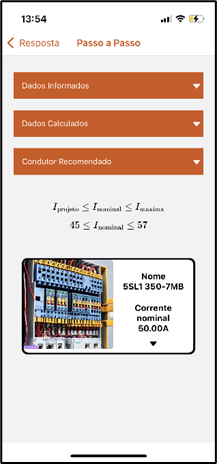

# Demonstrativo do Aplicativo

## Indice
- [Demonstrativo do Aplicativo](#demonstrativo-do-aplicativo)
  - [Indice](#indice)
  - [PÁGINA INICIAL](#página-inicial)
  - [FORMULÁRIO](#formulário)
  - [DADOS SUGERIDOS](#dados-sugeridos)
  - [ETAPAS DE CÁLCULO](#etapas-de-cálculo)
  - [REFERENCIAL TEÓRICO](#referencial-teórico)

## PÁGINA INICIAL

Essa primeira etapa de interação entre o usuário e o aplicativo ocorre assim que este é iniciado. É nesse processo que o usuário escolhe caso deseja realizar o dimensionamento de algum elemento elétrico ou caso deseja descobrir e analisar quais são as bases teóricas utilizadas para a realização dos cálculos no aplicativo.

## FORMULÁRIO

Caso decida dimensionar os elementos de um circuito, o usuário precisa informar ao programa os dados do projeto. Nesse processo são coletadas as informações que o endpoint REST necessita para a realização dos cálculos.
Assim, todos os dados necessários são coletados em um total de quatro etapas ou menos, para que, ao final do processo, sejam envidados ao endpoint que dimensionará os condutores, disjuntores e eletrodutos recomendados para a situação informada. 

O mesmo pode ser visto para dimensionamento de disjuntores e para dimensionamento de eletrodutos.

## DADOS SUGERIDOS

Após a coleta das informações e encaminhamento das mesmas ao endpoint, a resposta recebida deve ser formatada para o melhor entendimento do usuário final.
Esse processo é realizado através de uma tela de apresentação dos resultados. 

Esses componentes correspondem, respectivamente, aos condutores e suas dimensões sugeridas, disjuntores e uma sugestão de utilização e, por fim, eletrodutos e suas proporções recomendadas.

## ETAPAS DE CÁLCULO

Ao receber a resposta com sugestões para utilização em seu sistema, pode ser ainda necessário ao usuário final a validação se os dados informados estavam corretos. Não apenas isso como também a obtenção do conhecimento de como é realizado o processo de dimensionamento.
Com esse propósito, as telas agrupam as informações recebidas pelo programa juntamente com as equações e tabelas utilizadas para o dimensionamento dos elementos do circuito.
Dessa forma, assim como as respostas foram divididas em três sessões, o processo de cálculo também foi separado seguindo essa mesma lógica. 

Portanto, essas são as telas que finalizam o processo de dimensionamento dos elementos elétricos do sistema, processo esse iniciado na primeira tela do aplicativo.

## REFERENCIAL TEÓRICO

Retornando para a tela inicial do aplicativo, caso o usuário ao invés de dimensionar um circuito escolha descobrir mais sobre a base teórica utilizada nesse aplicativo.
Dessa forma, nessa etapa do aplicativo se reúnem todas as equações utilizadas no processo de dimensionamento. Além delas, também se encontram as tabelas da ABNT e das empresas fornecedoras dos elementos recomendados, como KanaFlex e Siemens, juntamente com os links para consulta da inteira documentação de onde foram retiradas tais informações.
Portanto, a reunião de todas essas informações em um mesmo local traz para essa tela o objetivo de disseminação de conhecimento sobre o processo como um todo. 

